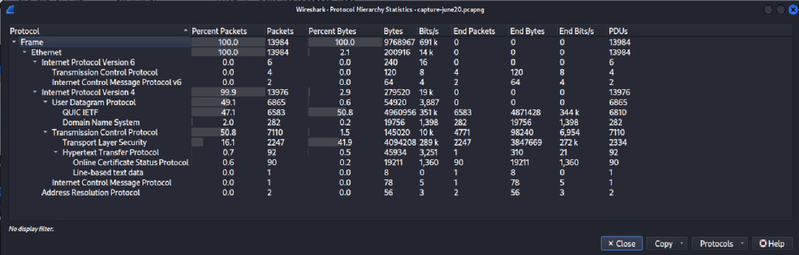
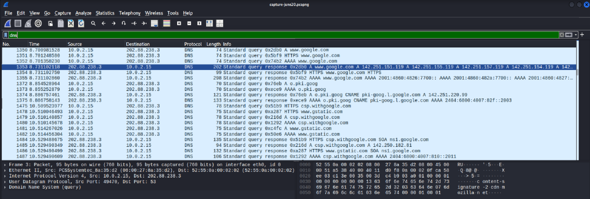
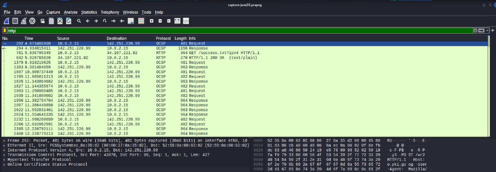
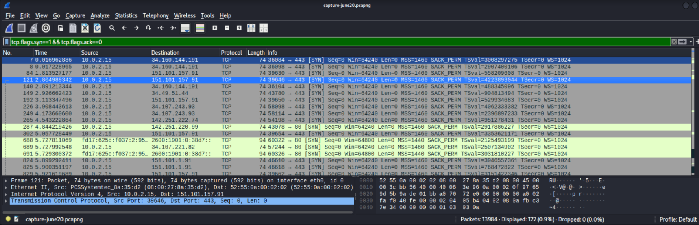

# 🔍 Network Traffic Analysis Report #1

## Capture Details

| Field | Value |
|---------|---------|
| Date | June 20, 2026 |
| Tool | Wireshark |
| Operating System | Kali Linux |
| Interface | eth0 |
| Capture File | capture-june20.pcapng |
| Total Packets Captured | 13,984 |
| New TCP Connections Observed | 122 |

---

## Objective

The objective of this analysis was to capture and inspect network traffic generated during normal web browsing activity and identify common protocols, DNS queries, and TCP connection behavior.

---

## Protocol Distribution

| Protocol | Packets | Percentage |
|----------|----------|------------|
| IPv4 | 13,976 | 99.9% |
| TCP | 7,110 | 50.8% |
| UDP | 6,865 | 49.1% |
| TLS | 2,247 | 16.1% |
| DNS | 282 | 2.0% |
| HTTP | 92 | 0.7% |
| OCSP | 90 | 0.6% |
| ARP | 2 | 0.0% |

### Protocol Hierarchy Observation

The majority of captured traffic used IPv4 (99.9%). TCP and UDP accounted for most network communications, while TLS traffic indicated secure encrypted connections. DNS traffic represented domain resolution requests generated during browsing activity. Only a small amount of HTTP traffic was observed, showing that most web communication was encrypted using HTTPS.

### Screenshot



---

## DNS Analysis

### Filter Used

```text
dns
```

### Domains Observed

- www.google.com
- o.pki.goog
- csp.withgoogle.com
- www.gstatic.com

### Observation

DNS queries were visible in plaintext and revealed domain resolution requests generated during web browsing activity. Multiple Google-related services were contacted, including search, certificate validation, and content delivery infrastructure.

### Screenshot



---

## HTTP Analysis

### Filter Used

```text
http
```

### Observation

A small amount of unencrypted HTTP traffic was observed.

Example:

```http
GET /success.txt?ipv4 HTTP/1.1
HTTP/1.1 200 OK
```

Most browsing traffic utilized HTTPS/TLS encryption. However, unencrypted HTTP traffic can still expose information to network observers.

### Screenshot



---

## TCP Connection Analysis

### Filter Used

```text
tcp.flags.syn==1 && tcp.flags.ack==0
```

### Observation

This filter displays TCP SYN packets used to initiate new TCP connections.

A total of **122 new TCP connection requests** were identified during the capture.

Most connections targeted:

- Port 443 (HTTPS)
- Port 80 (HTTP)

indicating normal web browsing activity.

### Screenshot



---

## Security Observations

1. Most web traffic was protected using TLS encryption.
2. DNS queries remained visible and revealed visited domains.
3. Only 0.7% of traffic used unencrypted HTTP.
4. A total of 122 new TCP connections were initiated during the capture.
5. The majority of traffic used IPv4 networking.
6. Secure HTTPS communication dominated browsing activity.

---

## Skills Demonstrated

- Wireshark Packet Analysis
- DNS Traffic Investigation
- HTTP Traffic Inspection
- TCP Handshake Analysis
- Protocol Identification
- Network Monitoring
- Security Observation

---

## Conclusion

This analysis provided hands-on experience with packet capture, protocol filtering, and network traffic investigation using Wireshark. Understanding how DNS, HTTP, HTTPS, TCP, UDP, and IP protocols operate is essential for networking, system administration, SOC analysis, and cybersecurity roles.

The exercise reinforced practical skills in identifying network behavior, interpreting protocol statistics, and analyzing communication patterns within a controlled environment.
